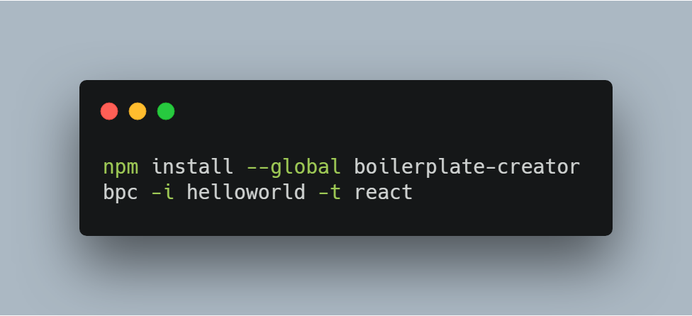

# boilerplate-creator

generate common boilerplate

[](https://travis-ci.org/oychao/boilerplate-creator) [](https://996.icu)

## What and Why

**boilerplate-creator** is a cli tool to generate common JavaScript boilerplate which are very messy to create.

## How to use

### Installation

```bash
npm i -g boilerplate-creator
# or use npx
```

### Demo

<p align="center">
    
</p>

#### Basic usage

```bash
bpc [options]
```

#### Create a NPM package or a CLI tool

```bash
bpc -i hello-npm -t npm
bpc -i hello-npm -t npm --ts
bpc -i hello-cli -t cli
bpc -i hello-cli -t cli --ts
```

### Custom Template Source

boilerplate-creator basiclly just pulls templates from GitHub, which means you can set your own template source as well. Note that only github reposities are supported and all templates must be put into a root fold named 'templates', see [oychao/common-boilerplate](https://github.com/oychao/common-boilerplate).

```bash
bpc -c https://github.com/your/repository
# say you have a 'my-template' under the 'templates' folder, then just:
bpc -i helloworld -t my-template
```

There are 4 templates(npm|npm-ts|cli|) are supported for now, please check the help document for more information.

```bash
bpc --help
```

## Licence

[](https://github.com/996icu/996.ICU/blob/master/LICENSE)
